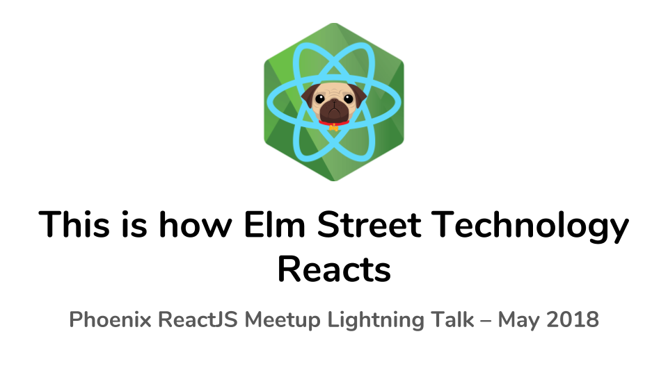
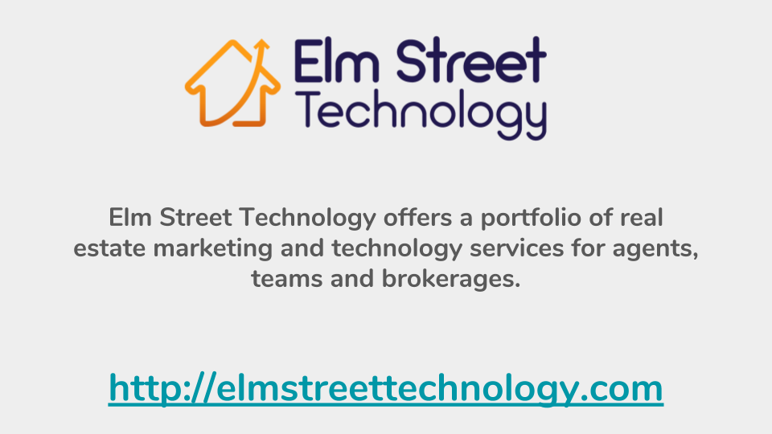
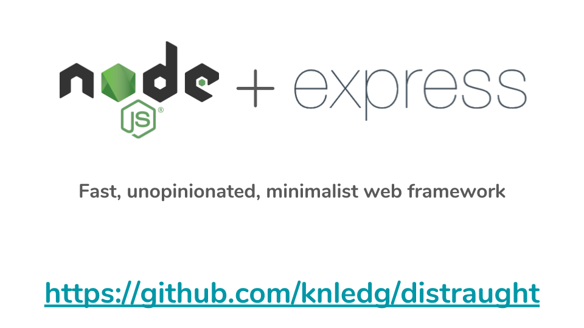
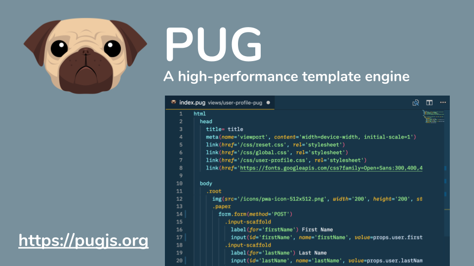
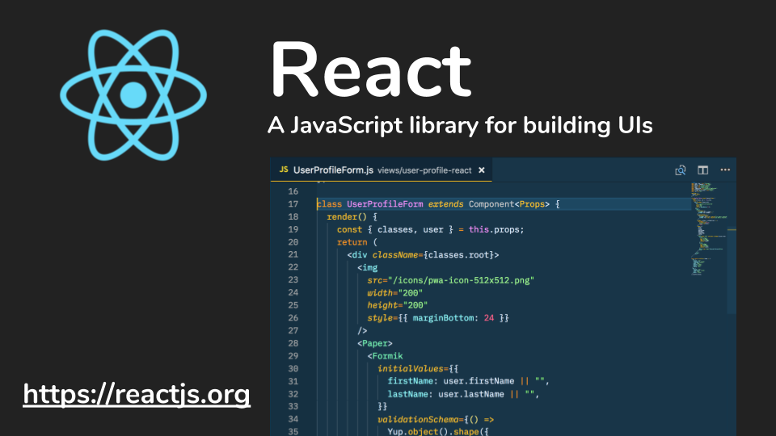
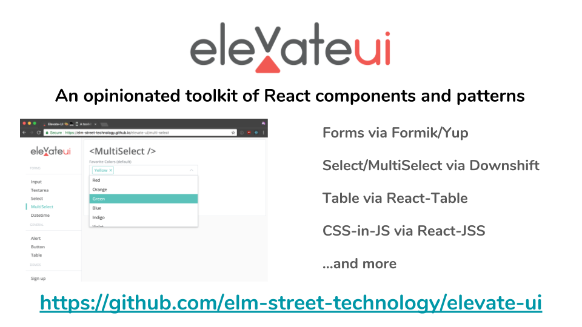

### Phoenix ReactJS Meetup Lightning Talk – May 2018

# This is how Elm Street Technology Reacts

Elm Street Technology builds software for the real estate industry– their main product is a CRM and search platform for real estate agents and brokers. Powered by Node+Express, the initial platform UI was built using Pug (the language formerly known as Jade) as a templating engine– with jQuery for basic dom manipulation.

As they continue to add new features to their platform– they are beginning to use React in order to more quickly build out widgets that are dynamic and usable within the existing CRM. In addition, new pages are being built and delivered using server-side rendering. A themeable component library brings it all together and helps ensure consistency across apps. More info can be found at https://github.com/elm-street-technology/elevate-ui.

#### About the presenter

Chris Heninger specializes in UI development and has shipped a whole bunch of apps built with React over the past three years. He enjoys identifying patterns in user interfaces and helping companies build scalable and maintainable component libraries to power their platforms. Some of his work and side-projects can be found at https://github.com/chrisheninger.

# Slides

>)
>)
>)

